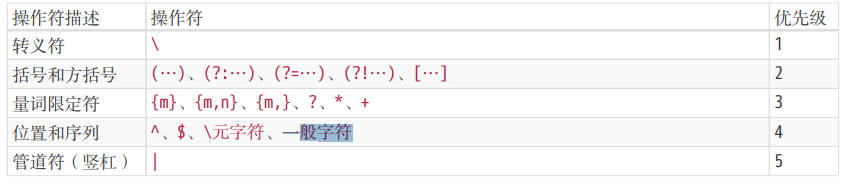
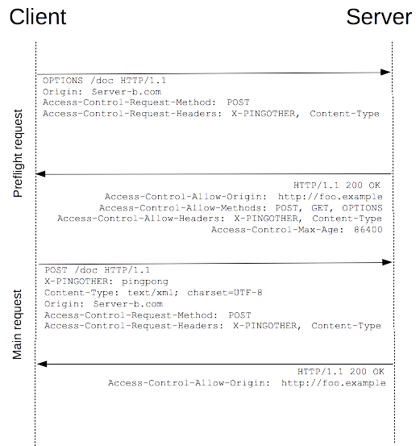
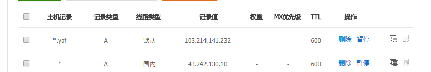

name:inverse
class: center, middle,inverse
layout: true

---

# 正则表达式

## Regex

Fighting

???

- 表单验证
- 字符串替换
- 字符串匹配
- 字符串分割
- 爬虫
- 安全审计
- 词法分析
- 日志分析
  https://deerchao.net/tutorials/regex/regex.htm
  http://www.cnblogs.com/hustskyking/archive/2014/01/18/how-regular-expressions-work.html

---

> 所谓正则表达式，就是一种描述字符串结构模式的形式化表达方法
> ————《精通正则表达式》

???

[《精通正则表达式》京东链接](https://item.jd.com/11070361.html)

```javascript
const reg = /((?=.*[0-9])(?=.*[a-z])|(?=.*[0-9])(?=.*[A-Z])|(?=.*[a-z])(?=.*[AZ]))^[0-9A-Za-z]{6,12}$/;
const reg1 = /(?!^[0-9]{6,12}$)(?!^[a-z]{6,12}$)(?!^[A-Z]{6,12}$)^[0-9A-Za-z]{6,12}$/;
```

回溯 /ab{1,3}bbc/.test('abbbc')
回溯 1 /".\*"/.test('"abc"de')
回溯 2 /^\d{1,3}?\d{1,3}$/.test('12345')

## 优先级 /^abc|bcd$/.test("abcd") // 是否为 true

## 符号优先级



---

# 几个问题

???

带着问题出发

---

- 匹配手机号
- 验证密码强度
- 添加千分位分隔符
- 匹配形如 abba 的字符串

???

### 以上示例，用正则不一定是最佳实践，但可以帮助理解正则

### 匹配手机要求

- 以'86-'开头时，后面必须是 1 开头的十一位数字
- 以'其它数字-'开头时，后面必须是 6 位以上数字
- 纯数字的手机，必须是 1 开头的十一位的纯数字

---

# 风格

### PCRE

### POSIX

???

php 是最吼的编程语言，因为同时支持两种风格

风格归风格，在各家引擎实现的时候功能并非完全照着实现了
比如 javascript 不支持：原子分组(atomic group)、共用集合(branch reset group)、占有匹配、注释模式、宽松格式模式(free-spacing mode)
已经进入提案的的特性(新版 chrome 已经支持)：负向断言、命名分组

```javascript
const RE_DATE = /(?<year>\d{4})-(?<month>\d{2})-(?<day>\d{2})/;
const matchObj = RE_DATE.exec('1999-12-31');
const year = matchObj.groups.year; // 1999
const month = matchObj.groups.month; // 12
const day = matchObj.groups.day; // 31
```

```javascript
// 命名分组的反向引用
const RE_TWICE = /^(?<word>[a-z]+)!\k<word>$/;
RE_TWICE.test('abc!abc'); // true
RE_TWICE.test('abc!ab'); // false

const RE_TWICE = /^(?<word>[a-z]+)!\1$/;
RE_TWICE.test('abc!abc'); // true
RE_TWICE.test('abc!ab'); // false
```

---

# 引擎

### DFA

### NFA

---

# 引擎

### DFA（确定有穷自动机）

### NFA（非确定有穷自动机）

???

编译原理、龙书

1.  DFA 对于文本串里的每一个字符只需扫描一次，比较快，但特性较少，不支持捕获与反向引用；NFA 要翻来覆去吃字符、吐字符，速度慢，但是特性丰富，所以反而应用广泛。
2.  只有 NFA 才支持 lazy 和 backreference 等特性；
3.  NFA 急于邀功请赏，所以最左子正则式优先匹配成功，因此偶尔会错过最佳匹配结果；DFA 则是“最长的左子正则式优先匹配成功”。 'perlman book'.match(/perl|perlman/)
4.  NFA 可能会陷入递归调用的陷阱而表现得性能极差。
5.  NFA 缺省采用 greedy 量词

```javascript
// NFA性能差演示   配合RegexBuddy演示
console.time();
'=TTT======='.match(/T(.+)+T/);
console.timeEnd();
```

主流的编程语言使用 NFA，mysql、awk 使用 DFA、grep 命令使用混合

---

# 元字符

---

- ###字符匹配

--

- ###位置匹配

--

- ###量词

---

.left-column[

## 字符匹配

]
.right-column[
.left[

.

[xyz]、[^xyz]、[x-y]

ab|cd

\d、\D

\w、\W

\s、\S

\n、\r

\t、\v

\f

]
]

???

- "."指代[^\r\n\u2028\u2029]
- \n 换行符
- \r 回车符
- \f 翻页符

---

.left-column[

## 字符匹配

## 位置匹配

]
.right-column[
.left[

^、$

\b、\B

(?=x)、(?!x)

(?<=x)、(?<!x)

]]

???

### 零宽断言、环视

- (?=x)正向肯定预查、正向零宽先行断言、 "aa12bb22cc32".match(/[a-z]{2}(?=22)/)
- (?!x)正向否定预查、负向零宽先行断言、 "aa12bb22cc32".match(/[a-z]{2}(?!22)/)
- (?<=x)负向肯定预查、正向零宽后发断言、 "aa12bb22cc32".match(/(?<=cc)\d{2}/)
- (?<!x)负向否定预查、负向零宽后发断言、 "aa12bb22cc32".match(/(?<!cc)\d{2}/)

---

.left-column[

## 字符匹配

## 位置匹配

## 量词

]
.right-column[
.left.right-img[

\- 匹配 0 次或多次表达式

\* 匹配 1 次或多次表达式

? 表达式可有可无

{n} 匹配 n 次表达式

{n,} 匹配 n 次或多次表达式

{n,m} 匹配 n 至 m 次表达式

]
]

???

[Mastering Quantifiers](https://www.rexegg.com/regex-quantifiers.html)

---

# Greedy、Lazy、Possessive

???
我们大多数前端人员可能知道 Greedy 和 Lazy，但是 Possessive 是个什么鬼？
（占有匹配是什么？如何使用占有匹配）
js 下的正则默认是贪婪匹配
那么如何变为惰性模式

1.贪婪匹配

```javascript
'123445'.match(/(\d*)/);
```

2.贪婪但是良心尚存。

```javascript
'123445'.match(/(\d*)\d\d/);
```

3.惰性匹配

```javascript
'123445'.match(/(\d{2,5}?)/);
```

4.惰性但是乐于助人

```javascript
'123445'.match(/^(\d{2,5}?)\d\d$/);
```

5.占有匹配

```javascript
'AAA'.match(/A++./);
```

6.贪婪与懒惰效率问题

```javascript
// 贪婪好于懒惰
'<abcdefghijklmnopqrstuvwxyz0123456789>'.match(/<.*>/);
'<abcdefghijklmnopqrstuvwxyz0123456789>'.match(/<.*?>/);
// 贪婪等于懒惰
'<abcdefghijklmnopqrstuvwxyz0123456789>aaaaaaaaaaaaaaaaaaaaaaaaaaaaaaaaaaa'.match(
  /<.*>/
);
// 最佳实践稍后讲;
```

---

# 贪婪陷阱

???

陷阱

```javascript
'<a href="/a/b/c" class="test">百度</a><span id="text">一下</span>'.match(
  /href="(.*)"/
);
```

惰性匹配解决方案

```javascript
'<a href="/a/b/c" class="test">百度</a><span id="text">一下</span>'.match(
  /href="(.*?)"/
);
```

---

# 懒惰陷阱

---

.left-column[

## 请求头

]
.right-column[
.left[

- Access-Control-Request-Headers
- Access-Control-Request-Method

  ]]

???

这两个请求头只出现在预检请求中，也就是我们经常碰到的 options 请求

浏览器自发行为

---

.left-column[

## 请求头

## 响应头

]
.right-column[
.left[

- Access-Control-Allow-Headers
- Access-Control-Request-Method
- Access-Control-Allow-Origin
- Access-Control-Expose-Headers
- Access-Control-Max-Age
- Access-Control-Allow-Credentials

]]

???

- 除了 Access-Control-Allow-Origin，其它的响应头均未实现\*号
- Access-Control-Allow-Headers 中以下是默认支持的，不需要列出来：Accept、Accept-Language、Content-Language、Content-Type。但 Content-Type 只能是 application/x-www-form-urlencoded、multipart/form-data 或 text/plain
- Access-Control-Allow-Credentials true/false 区分大小写
- Access-Control-Max-Age 单位为秒
- Access-Control-Expose-Headers 默认只能访问 Cache-Control、Content-Language、Content-Type、Expires、Last-Modified、Pragma

---

# 预检请求

--

### preflight

---

.left-column[

## 描述

]
.right-column[
.left[

> 跨域资源共享标准新增了一组 HTTP 首部字段，允许服务器声明哪些源站有权限访问哪些资源。另外，规范要求，对那些可能对服务器数据产生副作用的 HTTP 请求方法（特别是 GET 以外的 HTTP 请求，或者搭配某些 MIME 类型的 POST 请求）（非简单请求），浏览器必须首先使用 OPTIONS 方法发起一个预检请求（preflight request），从而获知服务端是否允许该跨域请求。服务器确认允许之后，才发起实际的 HTTP 请求。在预检请求的返回中，服务器端也可以通知客户端，是否需要携带身份凭证（包括 Cookies 和 HTTP 认证相关数据）。

]]

---

.left-column[

## 描述

## Simple Requests

]
.right-column[
.left[
满足如下条件：

- 请求方法：GET、HEAD、POST
- 自定义头：Accept、Accept-Language、Content-Language、Content-Type
- Content-Type 仅限值：text/plain、multipart/form-data、application/x-www-form-urlencoded
- 请求中的任意 XMLHttpRequestUpload 对象均没有注册任何事件监听器
- 请求中没有使用 ReadableStream 对象。

]]

???

- ReadableStream 只有 chrome 实现了
- XMLHttpRequestUpload 对象可以使用 XMLHttpRequest.upload 属性访问。

---

.left-column[

## 描述

## Simple Requests

## Preflight

]
.right-column[
.left[

    

]]

???

[触发 option 请求 demo](/demo/7.html)

预检请求被重定向会出错

预检请求需要返回 200 或 204，更推荐 204 No Content, douban 这里直接让预检进入了后端服务

[跨域 ajax 不报错 demo](/demo/9.html)

我们使用 Service workers 缓存 cdn 上的静态资源，但是跨域报错。
fetch mode https://developer.mozilla.org/zh-CN/docs/Web/API/Request/mode

Cache 相关 API https://developer.mozilla.org/zh-CN/docs/Web/API/Cache

SErvice workers https://developer.mozilla.org/zh-CN/docs/Web/API/Service_Worker_API

SErvice workers 未来很有想象空间的东西

---

#跨域安全

???

同源策略的初衷是为了安全，但牺牲了很多便捷性，然后有了跨域，跨域撕开了一道口子，如何保证安全？安全是头等大事，如果滥用跨域导致安全问题，那就得不偿失了。

- Access-Control-Allow-Origin：\* 与之前讨论的浏览器默认允许跨域，但不携带 cookie 一样
- Access-Control-Allow-Credentials:true 允许携带 cookie 的情况下，上面选项不能设置为\* 为什么？ （：为安全操碎了心的委员会 [不安全配置出错 demo](/demo/8.html)
- form 表单跨域提交安全问题
- [CSP 策略](https://developer.mozilla.org/zh-CN/docs/Web/HTTP/Headers/Content-Security-Policy__by_cnvoid)
- JSONP 的滥用，危险点在哪，如何防，是否 script 标签一定会发送 cookie？ 先看实例--> [JSON 安全问题 Demo](/demo/6.html) （crossorigin="anonymous"，传递错误的值也不会发送 cookie）

JSONP 防御可从 referer 来展开讲，以[什么值得买](https://www.smzdm.com)的个人信息接口展开来讲

CSP 策略可以到 twitter 演示

百度搜 CSP 阮一峰

- referer 匹配域名
- referer 未考虑空 ,人造空 referer [demo4](/demo/4.html), [Referrer-Policy](https://developer.mozilla.org/zh-CN/docs/Web/HTTP/Headers/Referrer-Policy)
- Content-Type: application/json; charset=utf-8 +/v8 触发 utf7-BOM
  

---

.right-column[
.left[

```
    const review = [
        '何为同源策略',
        '为何限制跨域',
        'HTTP协议',
        'CORS',
        '安全'
    ]
```

]]

---

```
    console.log("Thanks!");
```

```

```
